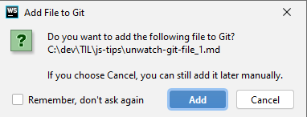

# Unwatch git file

So you are working on a project, add a new file,
and your editor quickly pops up with a notification asking if you want to add the new file to git.



Not thinking much you click "Add", and now you have to remember to remove the file from every commit you do.

Apparently there is a quick and easy way to remove the file from git, just open your terminal and type:
```bash
$ git rm --cached git/unwatch-git-file_1.png
```

Running this command will not remove the file from your file system, just from git's tracking list.