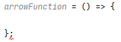

# Unnecessary semicolon arrow function

I am working on an Angular project in Webstorm, using the `Prettier` plugin for code formatting, and TSLint for standards enforcement.

The problem is that `Prettier` adds a semicolon to the end of an arrow function,
and then TSLint reports that as an error. 



As usual, the solution is very simple.
Just open the `tslint.json` file in the root of your project, and replace `semicolon` as follows.
```metadata json
{
  "rules": {
    ...
    "semicolon": [
        true, 
        "always", 
        "ignore-bound-class-methods"
    ],
  }
}
```

And viola, no errors when `Prettier` auto formats your code.
