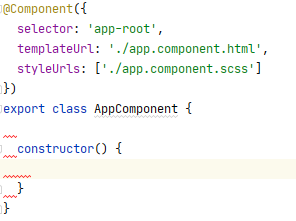

# Whitespace error on new line

Working in an angular project in webstorm has a lot of advantages,
but there is something that annoys me when starting a new project.

See all those errors?
Every new line creates lots of errors.



As usual, the solution is very simple.
Just open the `tslint.json` file in the root of your project, and add the following line to your rules.
```metadata json
{
  "rules": {
    ...
    "no-trailing-whitespace": false
  }
}
```

And viola, no errors in your file when creating a new line.
